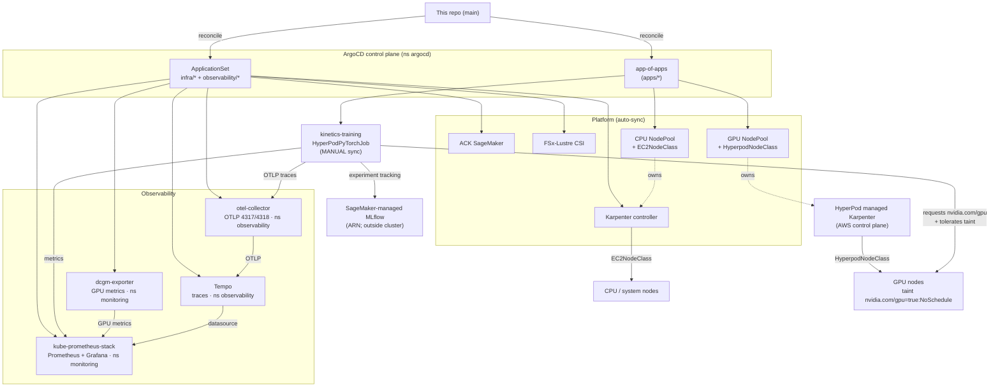

# Kinetics-Continious-Delivery

GitOps **delivery repo** for [`kinetics-pipeline`](https://github.com/huzaifa678/kinetics-pipeline)
— the HyperPod-on-EKS video action-recognition training platform. ArgoCD watches
this repo (it's the platform's `gitops_repo_url`) and reconciles the whole
cluster from it; the `kinetics-pipeline` Terraform only bootstraps ArgoCD and
points an `app-of-apps` at `gitops/bootstrap` here.

Keeping delivery separate from the platform source decouples *what is deployed*
from *how it's built*, puts every environment-specific value in one overlay, and
lets the GPU training job stay on manual sync.

## Architecture



- **GitOps split:** the ApplicationSet renders every upstream chart (multi-source,
  values from `environments/<env>/values/`); `apps/*` are standalone Applications
  for in-repo charts and the training job.
- **Two Karpenters, one fence:** the CPU NodePool (`EC2NodeClass`) and GPU NodePool
  (`HyperpodNodeClass`) are each owned by their respective controller via
  `nodeClassRef`; the GPU taint keeps CPU/system pods off GPU nodes so the two scale
  in harmony.
- **Two telemetry pipelines:** metrics → Prometheus/Grafana; traces → OTel collector
  → Tempo → Grafana (Prometheus can't store spans). MLflow is the SageMaker-managed
  server, reached by ARN.

## Layout

```
gitops/
  bootstrap/
    applicationset.yaml     # ApplicationSet: generates one Application per
                            #   upstream chart under infra/* and observability/*.
                            #   Multi-source — source[0] = upstream chart,
                            #   source[1] = this repo as a $values ref, so values
                            #   come from environments/<env>/values/<app>.yaml.
    root-apps.yaml          # app-of-apps for the standalone Applications in apps/
  infra/                    # chart coordinates only (name/version/repo/namespace)
    ack-sagemaker/          #   ACK SageMaker controller
    karpenter/              #   Karpenter
    fsx-csi-driver/         #   FSx for Lustre CSI driver
    keda/                   #   KEDA — autoscales the FastAPI inference Rollout
                            #   (ScaledObject in helm/inference-service; Prometheus
                            #   trigger, default in-cluster kube-prometheus-stack)
  observability/            # chart coordinates only
    kube-prometheus-stack/  #   Prometheus + Grafana (metrics; ns monitoring)
    dcgm-exporter/          #   NVIDIA DCGM GPU metrics (ns monitoring)
    opentelemetry-collector/#   OTLP trace gateway (ns observability)
    tempo/                  #   Grafana Tempo traces backend (ns observability)
  environments/dev/values/  # the ONLY place env-specific values live:
                            #   clusterName, region, interruption queue, the
                            #   training job's MLflow URI + OTel endpoint, and the
                            #   collector/Tempo/Grafana-datasource wiring.
  config/
    karpenter/              # in-repo chart: CPU Karpenter NodePool + EC2NodeClass
    hyperpod-karpenter/     # in-repo chart: GPU HyperpodNodeClass + NodePool
                            #   (instanceGroups + GPU taint from values)
  apps/                     # standalone Applications:
    karpenter-config.yaml   #   the in-repo CPU Karpenter config chart (auto-sync)
    hyperpod-karpenter.yaml #   the GPU Karpenter config chart (auto-sync; retry +
                            #   SkipDryRunOnMissingResource for CRD ordering)
    kinetics-training.yaml  #   the HyperPodPyTorchJob (MANUAL sync — a push must
                            #   never silently launch a GPU run)
cue/schema.cue              # strict schema every rendered/static manifest is vetted against
helm/training-job/          # the HyperPodPyTorchJob chart (training workload)
scripts/validate-manifests.sh
```

## How a change flows

1. Edit a chart version under `gitops/infra|observability/*/app.yaml`, an
   environment value under `gitops/environments/dev/values/`, or the training
   chart under `helm/training-job/`.
2. Push. ArgoCD (already bootstrapped by the platform Terraform) syncs the
   ApplicationSet and app-of-apps automatically — except the
   **`kinetics-training`** Application, which is manual-sync.
3. To launch a training run, scale the HyperPod GPU group up, then sync
   `kinetics-training` (the job only consumes GPUs once GPU nodes exist).

## Training-job knobs (this repo)

`helm/training-job/values.yaml` carries the experiment-tracking and
observability wiring consumed by the trainer:

- `tracking.mlflowTrackingUri` — SageMaker-managed MLflow server ARN
  (`terraform output mlflow_tracking_server_arn`). Empty ⇒ tracking disabled.
- `tracking.experimentName` — MLflow experiment name.
- `observability.otelExporterOtlpEndpoint` — OTLP/HTTP collector endpoint.
  Empty ⇒ the trainer's OpenTelemetry tracer is a no-op.
- `observability.serviceName` / `observability.logLevel`.

## ETL Workflow (Kinetics shard builder)

`helm/etl-shards/` contains an Argo Workflows **WorkflowTemplate** that decodes
Kinetics-400 clips (from the FSx `/data` mount) into WebDataset shards on S3,
fanning out `numShards` pods (`parallelism` at a time) — one pod per shard.

### How it fits the platform

| Layer | What it does |
|---|---|
| `gitops/infra/argo-workflows/` | Installs the Argo Workflows controller + CRDs (auto-sync via the ApplicationSet) |
| `helm/etl-shards/` | Helm chart that renders `WorkflowTemplate/etl-shards-build` + `ServiceAccount/etl-shards` |
| `gitops/apps/etl-shards.yaml` | **Manual-sync** ArgoCD Application — reconciles the WorkflowTemplate spec |
| `gitops/environments/<env>/values/etl-shards.yaml` | Per-env overrides: S3 output path, parallelism, IRSA role ARN |

ArgoCD owns the *spec* (WorkflowTemplate). A human or CI step owns the *run*
(`argo submit`). A git push **never** silently starts an ETL run.

### Running the ETL

```bash
# 1. Dry-run: inspect the rendered WorkflowTemplate for the target env
make etl-render              # dev (default)
make etl-render ETL_ENV=prod

# 2. ArgoCD must have synced the etl-shards Application at least once
#    (it installs the WorkflowTemplate CRD + spec). Do that from the UI or:
argocd app sync etl-shards

# 3. Submit a run (kubeconfig must point at the right cluster)
make etl-run                      # dev, fires and returns
make etl-run ETL_ENV=prod
make etl-run ARGO_FLAGS="--watch" # stream step-by-step progress
```

### Fan-out pattern

The WorkflowTemplate uses a `withSequence` loop (items `0..numShards-1`) — the
direct Argo equivalent of the old indexed Job's `JOB_COMPLETION_INDEX`. Each
iteration calls the `build-one-shard` template with `--shard-id {{item}}`.

```
WorkflowTemplate/etl-shards-build
└── steps: build-shards
    └── withSequence count=64
        └── build-one-shard  (pod, parallelism=8)
            └── kinetics-build-shards --shard-id N
```

### Changing ETL parameters

Edit `helm/etl-shards/values.yaml` (global defaults) or the per-env overlay
(`gitops/environments/<env>/values/etl-shards.yaml`) and push. ArgoCD will pick
up the change on the next manual sync of `etl-shards`. Parameters that changed
only affect the *next* `argo submit` — running workflows are unaffected.

### IRSA role

The `etl-shards` ServiceAccount needs write access to the output S3 prefix.
After Terraform creates the role:

```bash
terraform output kinetics_etl_shards_role_arn
# → arn:aws:iam::533267178572:role/kinetics-etl-shards-dev
```

Add it to the env overlay:

```yaml
# gitops/environments/dev/values/etl-shards.yaml
serviceAccount:
  annotations:
    eks.amazonaws.com/role-arn: arn:aws:iam::533267178572:role/kinetics-etl-shards-dev
```

## Validation

```bash
bash scripts/validate-manifests.sh   # requires helm + cue
```

Renders the training-job chart (default **and** FSx-enabled) plus the in-repo
Karpenter config chart, and vets every rendered document — and all static
`gitops/` manifests — against `cue/schema.cue#Resource`. An unknown field,
wrong type, or missing required key fails the build.
